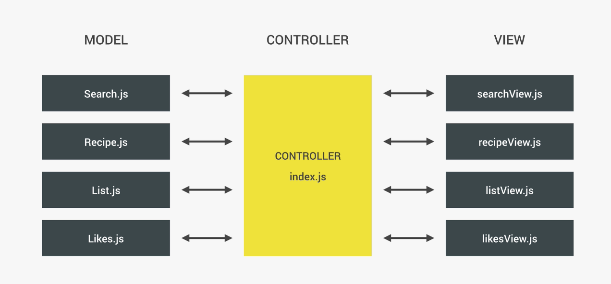

# Forkify 

## Design:

## Planning:

## Execution:

## JavaScript Concepts used:

## Model Controller View:

## Modern Webpacks Used: 
* webpack
* babel

## Final Product:

### Future Developers:

Run: `npm install` to install node modules.
You can run then run `npm run start` to do live loads.

