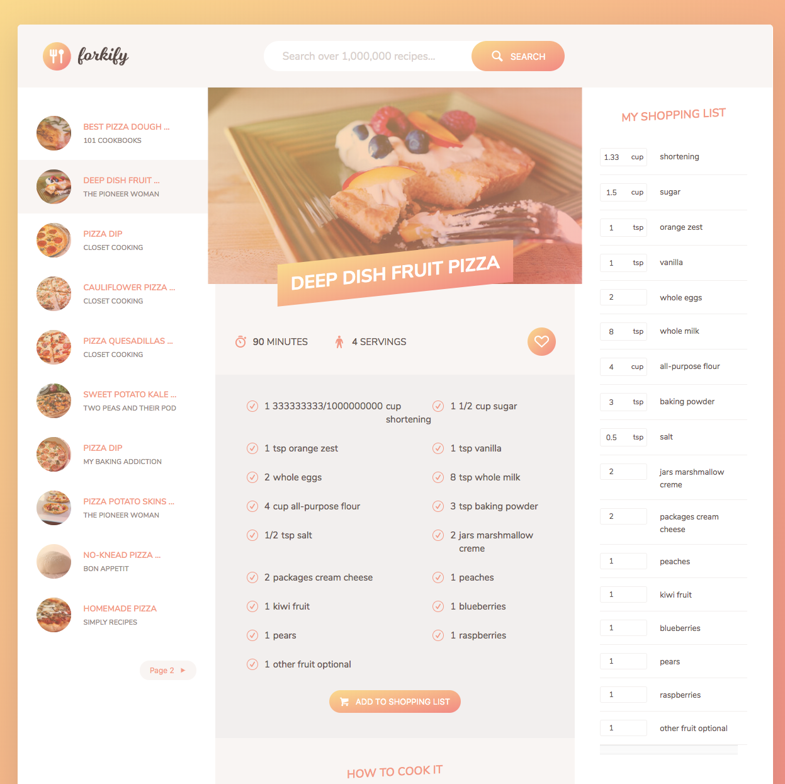

# Forkify

### Update March 2020:
Food2Fork API has shut down :disappointed:

https://www.food2fork.com/ 

This is a JavaScript project that pulls from the food2fork API.
API Key is like a password to make requests from an Application Programming Interface (API). 

Read more at https://www.food2fork.com/about/api

## Planning:
I am a big fan of taking big projects and splitting them up into small, easily managable components. This project continues that ideology by beginning with the framework and configuration setup. Then moving into each functionality of MVP to continue to build piece after piece till completation. 

## Execution:
The execution of this project took longer than expected as I did this as a personal project for continuing education. 

## JavaScript Concepts used:
* ES6 Modules
* Application State - 

## Model Controller View:

## Modern Webpacks Used: 
* webpack
* babel

## Final Product:

### Future Developers:

Run: `npm install` to install node modules.
You can run then run `npm run start` to do live loads.

